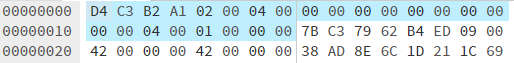
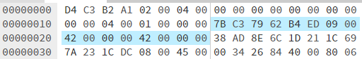
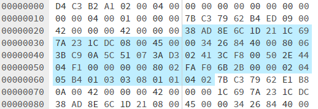

# pcap文件格式

## pcap header

**day3.pcap文件头数据**

**pcap header 格式**

| 0000-0017 | pcap header | size | desc |
|-----------|-------------|------|-----|
| 0000-0003 | Magic       | 4B | 一个无符号值，其值为0xA1B2C3D4或0xA1B23C4D，标记文件开始、字节顺序（大小端）和数据包时间戳单位。这个数字可以启发式识别pcap文件，区分大小端字节顺序，如果值为0xA1B2C3D4，表示数据包时间戳单位为秒和微秒\，如果值为0xA1B23C4D，表示数据包时间戳单位为秒和纳秒 |
| 0004-0005 0006-0007 | Major Minor | 2B 2B | pcap文件版本号 Major 主要版本，Minor 次要版本 |
| 0008-000B | ThisZone      | 4B | 未使用。GMT（UTC）与本地时区的相差，单位秒（s），如果是GMT则为0。一般为0 |
| 000C-000F | SigFigs       | 4B | 未使用。时间戳精度，一般为0 |
| 0010-0013 | SnapLen       | 4B | 一个无符号值，指示从每个数据包抓获的最大长度，以octet为单位（1 octet = 8 bit，即1 byte）。该值不得为0，如果未指定限制，该值应该大于或等于文件中最大数据包长度的数字 |
| 0014-0017 | LinkType      | 4B | 数据链路类型 |

**day3.pcap文件头内容**

| pcap header | value |desc|
|-------------|-------|----|
| Magic | 0xD4C3B2A1 | 小端 |
| Version | 0x0002 &ensp;&ensp;&ensp;&ensp;0x0004 | 主要版本 次要版本 |
| ThisZone | 0 | - |
| SigFigs  | 0 | - |
| SnapLen | 0x00040000 | 最大长度 |
| LinkType | 0x00000001 | IEEE 802.3 Ethernet |

## packet header

数据包头可以有多个，每个数据包头后面都跟着真正的数据包

**day3.pcap Packet1数据包头数据**

**day3.pcap数据包头对应的数据包Packet1**

**packet header 格式**

| 0000-000F | packet header | size | desc |
|-----------|---------------|------|------|
| 0000-0003 0004-0007 | Timestamp | 4B 4B | 无符号值，时间戳高位，单位秒（s） 无符号值，时间戳低位，单位微秒（ms）或纳秒（ns），其单位由文件头的Magic值决定 |
| 0008-000B | CapLen | 4B | 无符号值，抓取到的数据帧长度，该值小于OriLen或文件头的SnapLen值 |
| 000C-000F | OriLen | 4B | 无符号值，数据包出现在网络上的实际长度，一般不大于CapLen，一般和CapLen值一样 |

**packet 数据包大小**

| 0010- | size | desc |
|--------|------|------|
| 0010- |CapLen|数据包具体内容，长度就是CapLen|

**day3.pcap Packet1数据包头内容**

| packet header | value |desc|
|-------------|-------|----|
| Timestamp | 0x6279C37B 0x0009EDB4 | 时间戳高位（s） 时间戳低位（ms） |
| CapLen | 0x00000042 | 捕获数据帧长度 |
| OriLen | 0x00000042 | 原始数据帧长度 |

**packet Packet1数据包大小**

Packet1数据包大小为66B（0x42 = 66）
